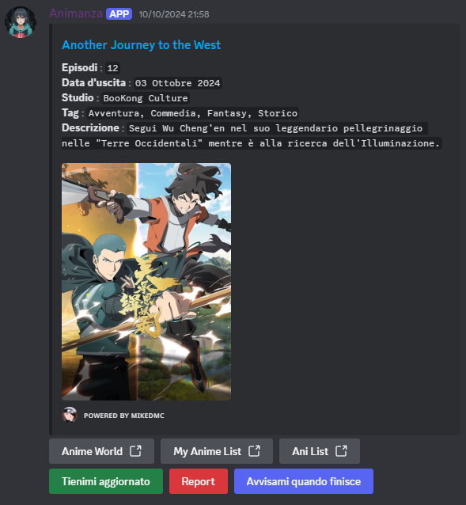
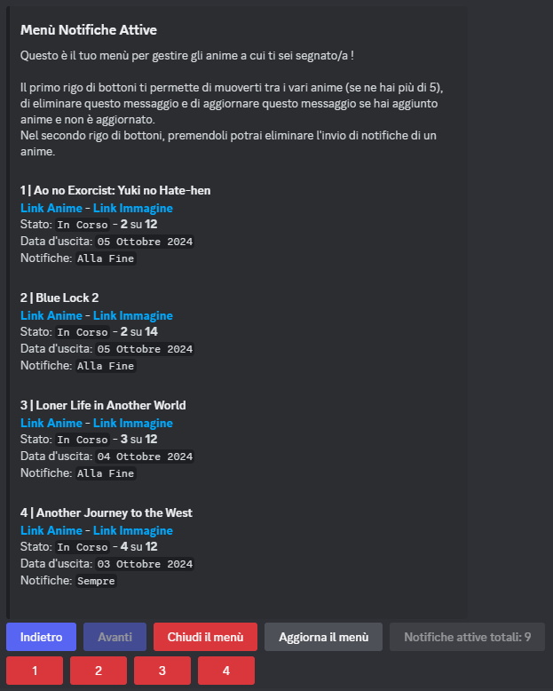

 # Animanza Discord Bot

Un Bot Discord creato per mandare notifiche all'uscita di nuovi anime su discord e non solo!

## Funzionalità
- Notifiche automatiche sugli anime appena usciti nei canali dove è stato utilizzato il comando /imposta-canale.
- La notifica avrà sotto dei bottoni, oltre ai link utili, sarà possibile farsi mandare un messaggio privato ogni volta che esce una nuova puntata, o se preferisci, farti mandare un messaggio quando è finito l'anime. (Così da guardartelo tutto insieme come faccio io)
- Con il comando /mostra-notifiche-attive ti manderà il bot un messaggio in privato, con un pannello dotato di vari bottoni per navigare tra le notifiche a gruppi di 5. Sarà quindi possibile eliminare eventuali notifiche o visualizzare (circa) lo stato degli anime attuali.

## Tecnologie Utilizzate
- **Linguaggio:** Java
- **Librerie:** Discord JDA
- **Database:** MySql

## Screenshot

## Licenza
Questo progetto è sotto licenza MIT.

## Disclaimer
Questo bot utilizza tecniche di web scraping per ottenere informazioni sugli anime dal sito Anime World. Non sono in alcun modo affiliato con Anime World, né questo progetto è approvato o sponsorizzato dal sito. Tutti i diritti relativi ai contenuti degli anime appartengono ai rispettivi proprietari.
